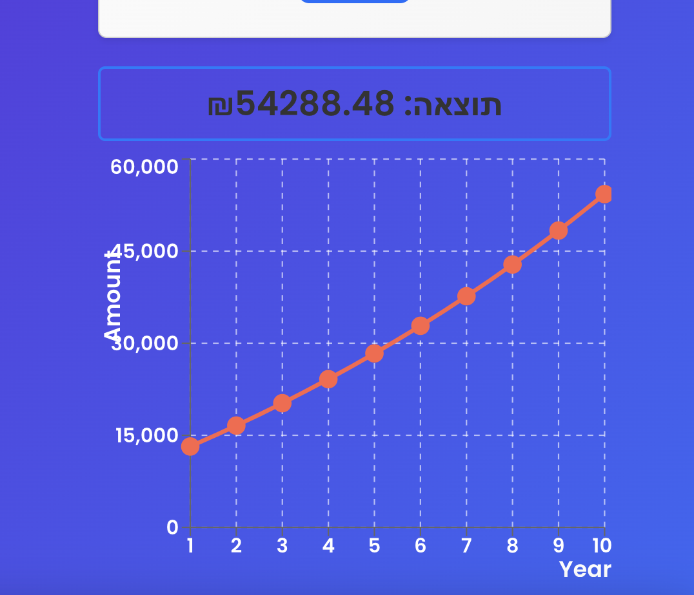

# Investment Calculator

### Example of My Project
1. **Initial screen: placeholders show example values:**

2. **Updated screen: placeholders prompt the user directly:**

3. **Graph of our investment:**



## Description
Investment Calculator is a web application that allows users to calculate the future value of an investment based on an initial amount, annual interest rate, investment period, monthly contributions, and compound frequency.

The app is built with React and styled with Bootstrap, providing a clean and user-friendly interface.

## Features
- Calculate the future value of an investment with compound interest.
- Input fields for initial investment, investment period (years/months), annual interest rate, and compound frequency.
- Option to add monthly contributions to the investment.
- User-friendly interface with custom background and a visually appealing layout.
- Prominent button and header for easy navigation.

## Technologies
- **React** - JavaScript library for building user interfaces.
- **Bootstrap** - CSS framework providing responsive and ready-to-use UI components.
- **Custom CSS** - For additional styling, including background and color adjustments.

## Installation and Setup

1. **Clone the repository**:
   ```bash
   git clone https://github.com/GilMatzafi/investment-calculator.git

2. **Navigate to the project directory**:
   ```bash
   cd investment-calculator

3. **Install dependencies:**:
   ```bash
   npm install

4. **Run the application**:
   ```bash
   npm start


The app should automatically open at http://localhost:3000.

## Contributions
Contributions are welcome! If you’d like to contribute code to improve this project, please follow these steps:

1. **Fork the repository.**
2. **Create a new branch for your feature or bug:**
    ```bash
    git checkout -b feature-name
3. **Make your changes and commit them:**
    ```bash
    git commit -m "Description of changes"
4. **Push your changes to your forked repository:**
    ```bash
    git push origin feature-name
5. **Open a Pull Request (PR) with a detailed description of your changes.**

**Thank you for helping to improve this project!**
